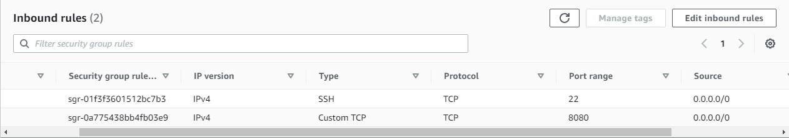
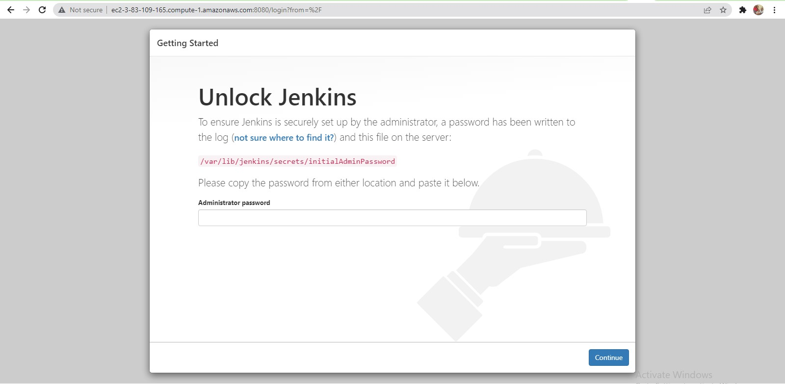
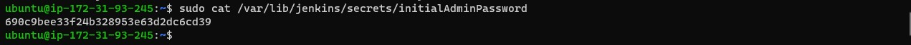
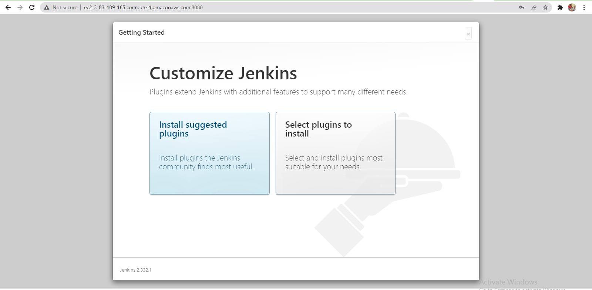

# **INSTALL AND CONFIGURE JENKINS SERVER** #

DevOps is about Agility, and speedy release of software and web solutions. One of the ways to guarantee fast and repeatable deployments is Automation of routine tasks.

In this project we are going to start automating part of our routine tasks with a free and open source automation server – Jenkins. It is one of the mostl popular CI/CD tools, it was created by a former Sun Microsystems developer Kohsuke Kawaguchi and the project originally had a named "Hudson".

In our project we are going to utilize Jenkins CI capabilities to make sure that every change made to the source code in GitHub https://github.com/yourname/tooling will be automatically be updated to the Tooling Website.

## **Task** ##
Enhance the architecture prepared in Project 8 by adding a Jenkins server, configure a job to automatically deploy source codes changes from Git to NFS server.

Here is how your updated architecture will look like upon competion of this project:

## **INSTALL AND CONFIGURE JENKINS SERVER** ##

### **Step 1** – Install Jenkins server ###
Create an AWS EC2 server based on Ubuntu Server 20.04 LTS and name it "Jenkins"

Install JDK (since Jenkins is a Java-based application)
~~~
sudo apt update
sudo apt install default-jdk-headless
~~~
Install Jenkins
~~~
wget -q -O - https://pkg.jenkins.io/debian-stable/jenkins.io.key | sudo apt-key add -
sudo sh -c 'echo deb https://pkg.jenkins.io/debian-stable binary/ > \
    /etc/apt/sources.list.d/jenkins.list'
sudo apt update
sudo apt-get install jenkins
~~~

Check Jenkins status
~~~
sudo systemctl status jenkins
~~~

Open port 8080 for Jenkins in the Inbound rule for the Instance

Access the newly installed Jenkins from
~~~
http://<Jenkins-Server-Public-IP-Address-or-Public-DNS-Name>:8080
~~~

Obtain the required password form
~~~
sudo cat /var/lib/jenkins/secrets/initialAdminPassword
~~~
Copy and paste to the browser

