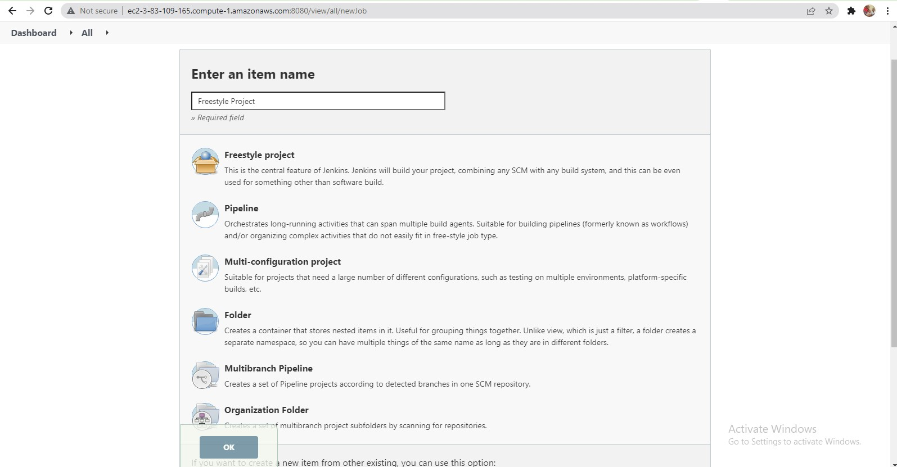

# **INSTALL AND CONFIGURE JENKINS SERVER** #

DevOps is about Agility, and speedy release of software and web solutions. One of the ways to guarantee fast and repeatable deployments is Automation of routine tasks.

In this project we are going to start automating part of our routine tasks with a free and open source automation server – Jenkins. It is one of the mostl popular CI/CD tools, it was created by a former Sun Microsystems developer Kohsuke Kawaguchi and the project originally had a named "Hudson".

In our project we are going to utilize Jenkins CI capabilities to make sure that every change made to the source code in GitHub https://github.com/yourname/tooling will be automatically be updated to the Tooling Website.

## **Task** ##
Enhance the architecture prepared in Project 8 by adding a Jenkins server, configure a job to automatically deploy source codes changes from Git to NFS server.

Here is how your updated architecture will look like upon competion of this project:

## **INSTALL AND CONFIGURE JENKINS SERVER** ##

### **Step 1** – Install Jenkins server ###
Create an AWS EC2 server based on Ubuntu Server 20.04 LTS and name it "Jenkins"

Install JDK (since Jenkins is a Java-based application)
~~~
sudo apt update
sudo apt install default-jdk-headless
~~~
Install Jenkins
~~~
wget -q -O - https://pkg.jenkins.io/debian-stable/jenkins.io.key | sudo apt-key add -
sudo sh -c 'echo deb https://pkg.jenkins.io/debian-stable binary/ > \
    /etc/apt/sources.list.d/jenkins.list'
sudo apt update
sudo apt-get install jenkins
~~~

Check Jenkins status
~~~
sudo systemctl status jenkins
~~~

Open port 8080 for Jenkins in the Inbound rule for the Instance

Access the newly installed Jenkins from
~~~
http://<Jenkins-Server-Public-IP-Address-or-Public-DNS-Name>:8080
~~~

Obtain the required password form
~~~
sudo cat /var/lib/jenkins/secrets/initialAdminPassword
~~~
Copy and paste to the browser

Select **Install Suggested Plugins**

Once plugins installation is done – create an admin user and you will get your Jenkins server address.

The installation is completed!

### **Step 2** – Configure Jenkins to retrieve source codes from GitHub using Webhooks ###

In this part, you will learn how to configure a simple Jenkins job/project (these two terms can be used interchangeably). This job will will be triggered by GitHub webhooks and will execute a ‘build’ task to retrieve codes from GitHub and store it locally on Jenkins server.

1. Enable Webhook in the Github settings

If you encounter an error about the webhook not reachable, **allow ICMP traffic on Inbound traffic on the Jenkins EC2 instance.**

2. Go to Jenkins web console, click "New Item" and create a "Freestyle project"

3. To connect your GitHub repository, you will need to provide its URL, copy from the repository itself.

4. In configuration of your Jenkins freestyle project choose Git repository, provide there the link to your Tooling GitHub repository and credentials (user/password) so Jenkins could access files in the repository.

5. Click "Build Now" button, if you have configured everything correctly, the build will be successfull and you will see it under

Click "Configure" your job/project and add these two configurations
Configure triggering the job from GitHub webhook:

